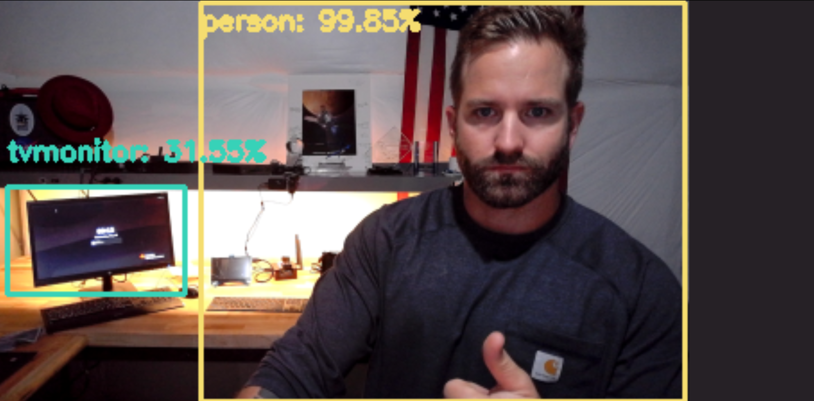
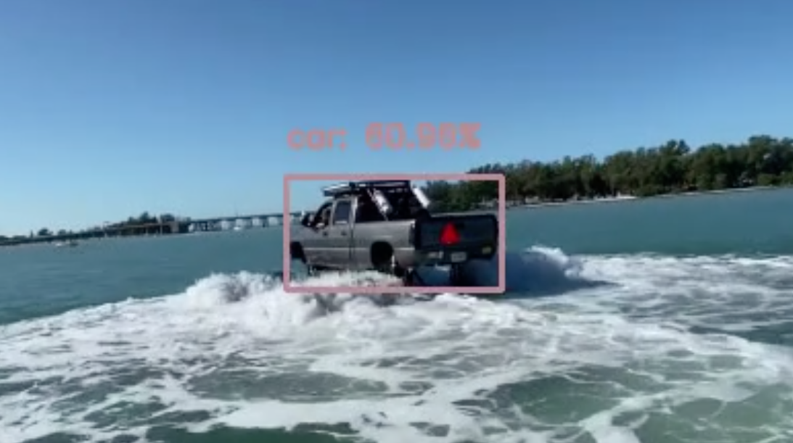
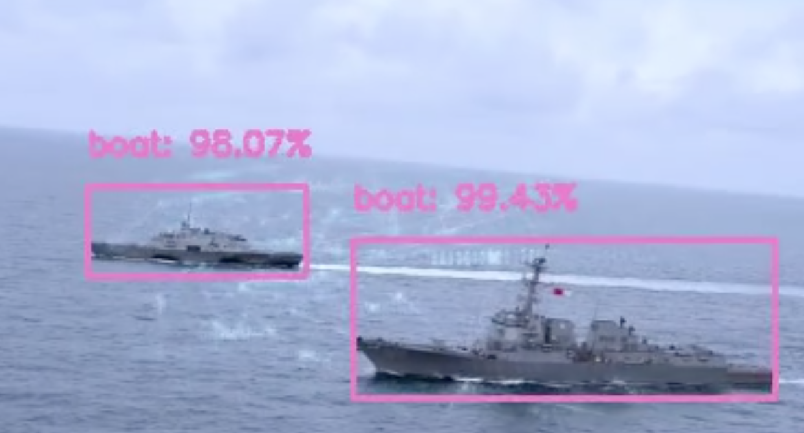

# Real-time Object Detection

> - video source: https://www.lockheedmartin.com/en-us/products/littoral-combat-ship-lcs.html
> - video source: https://www.youtube.com/watch?v=ohxGA7fpfu0&t=14s
> - 

disclaimer: it's a ship, but this is default COCO trained model

Using SSD and OpenCV